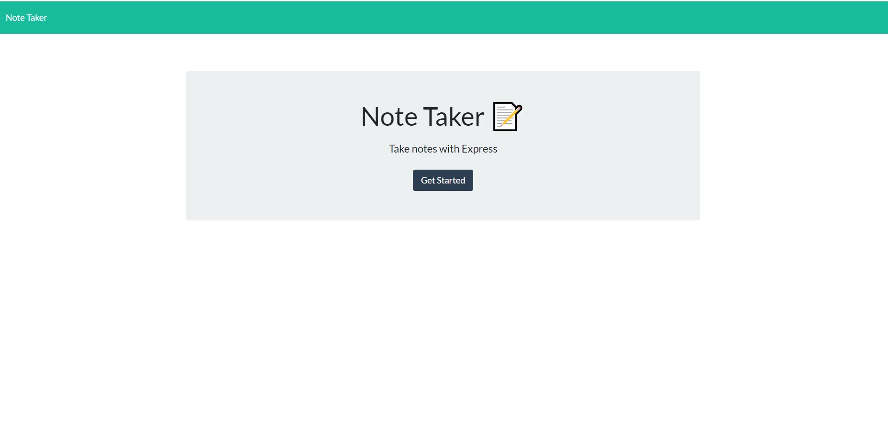

# NoteTaker

## Table of contents
  * [Description](#Description)
  * [Technologies](#Technologies)
  * [Installation](#Installation)
  * [Usage](#Usage)
  * [Contributing](#Contributing)
  * [Test](#Test)
  * [Questions](#Questions)
  * [Credits](#Credits)
  * [License](#License)

  ## Description
 The following project allows a small business owner to be able to create and save notes in order to keep track of tasks need to complete.

  ##  Technologies
  * node.js
  * express
  * Javascript
  * HTML
  * CSS

  ## Installation
  * Create a repo on GitHub
  * Clone the repo into your desire folder
  * Develop the front end application
  * Create a .gitignore to save the node_modules
  * Open the integrated terminal and install a package json
  * Run npm init, npm install, npm install require, npm install fs
  * Create the server file and set the port
  * Create the API route and HTML to store and retrieve the information
  * Run into the integrated terminal by using the command node server.js
  * Commit the changes

  ## Usage
  It is useful for a small business owner or an employye to have an application that allows to save notes. 

  ## Test
  
  

  ## Questions
  For further questions please contact the author

  ## Credits
  Sofia Rojas sofiacrf@github.com

  ## Link to github repo 
  https://sofiacrf.github.io/NoteTaker/
  https://github.com/Sofiacrf/NoteTaker.git

